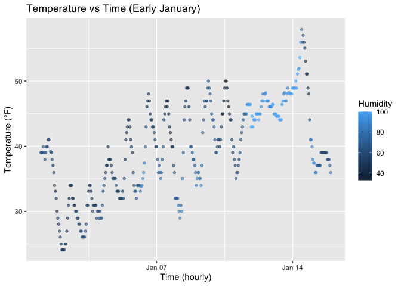

P8105_hw1_ab6169
================
Amrutha Banda
2025-09-20

## Problem 1

I first started by installing the necessary packages.

After this, I loaded the early_january_weather dataset.

``` r
data("early_january_weather")
```

Here are the variables in the dataset.

``` r
names(early_january_weather)
```

    ##  [1] "origin"     "year"       "month"      "day"        "hour"      
    ##  [6] "temp"       "dewp"       "humid"      "wind_dir"   "wind_speed"
    ## [11] "wind_gust"  "precip"     "pressure"   "visib"      "time_hour"

I looked at the size of the dataset by seeing how many rows and columns
there are.

``` r
nrow(early_january_weather)
```

    ## [1] 358

``` r
ncol(early_january_weather)
```

    ## [1] 15

Then, I found the mean temperature

``` r
mean(early_january_weather$temp, na.rm = TRUE)
```

    ## [1] 39.58212

This is a scatterplot of temperature versus time, with color
representing humidity.

``` r
ggplot(early_january_weather, aes(x = time_hour, y = temp, color = humid)) +
  geom_point(alpha = 0.6, size = 1.2) +
  labs(
    title = "Temperature vs Time (Early January)",
    x = "Time (hourly)",
    y = "Temperature (°F)",
    color = "Humidity"
  )
```

<!-- -->

``` r
ggsave("scatter_plot_tempvstime.pdf", height=4, width=6)
```

In Problem 1, I looked at the `early_january_weather` dataset from the
`moderndive` package. The important variables in this dataset include
`origin`, `year`, `month`, `day`, `hour`, `time_hour`, `temp`, `dewp`,
`humid`, `wind_dir`, `wind_speed`, `wind_gust`, `precip`, `pressure`,
and `visib`. This dataset has 358 rows and 15 columns. The mean
temperature in this dataset is 39.5821229 F. This value represents the
average air temperature recorded across all observations in early
January. To better understand temperature vs time, I created a
scatterplot. This scatterplot shows that the temperatures have increased
over the two week period. I also notice that humidity is lower in the
beginning of the month of January. As the month progresses, humidity
increases. I see lighter blue data points clustered near the Janurary
14th time.

## Problem 2

I created a dataframe.

``` r
weather_df <- 
  tibble(
    norm_sample = rnorm(10),
    vec_logical = norm_sample > 0,
    vec_char    = c("a","b","c","d","e","f","g","h","i","j"),
    vec_factor  = factor(c("low","medium","high","low","medium",
                           "high","low","medium","high","low"))
  )
```

Then, I took the mean of the variables `norm_sample` and `vec_logical`.
Taking the mean of `vec_char` and `vec_factor` returned an error because
characters and factors aren’t numerical and cannot be averaged.

``` r
mean(pull(weather_df, norm_sample))
```

    ## [1] 0.1462885

``` r
mean(pull(weather_df, vec_logical))
```

    ## [1] 0.4

When I write a code chunk that applies the `as.numeric`, I see that
`as.numeric(weather_df$vec_factor)` and
`as.numeric(weather_df$vec_logical)`, return numbers. Applying
`as.numeric` to the `vec_char` variable returns NA’s with a warning
about coercion. This is because letters have no numeric meaning. This
explains why you cannot take their mean. Yes, this does explain what
happened when I tried to take the mean. The mean works for numeric and
logical variables but not for character an factor variables because they
don’t have a numeric meaning.

``` r
as.numeric(weather_df$vec_logical)
as.numeric(weather_df$vec_char)
```

    ## Warning: NAs introduced by coercion

``` r
as.numeric(weather_df$vec_factor)
```
